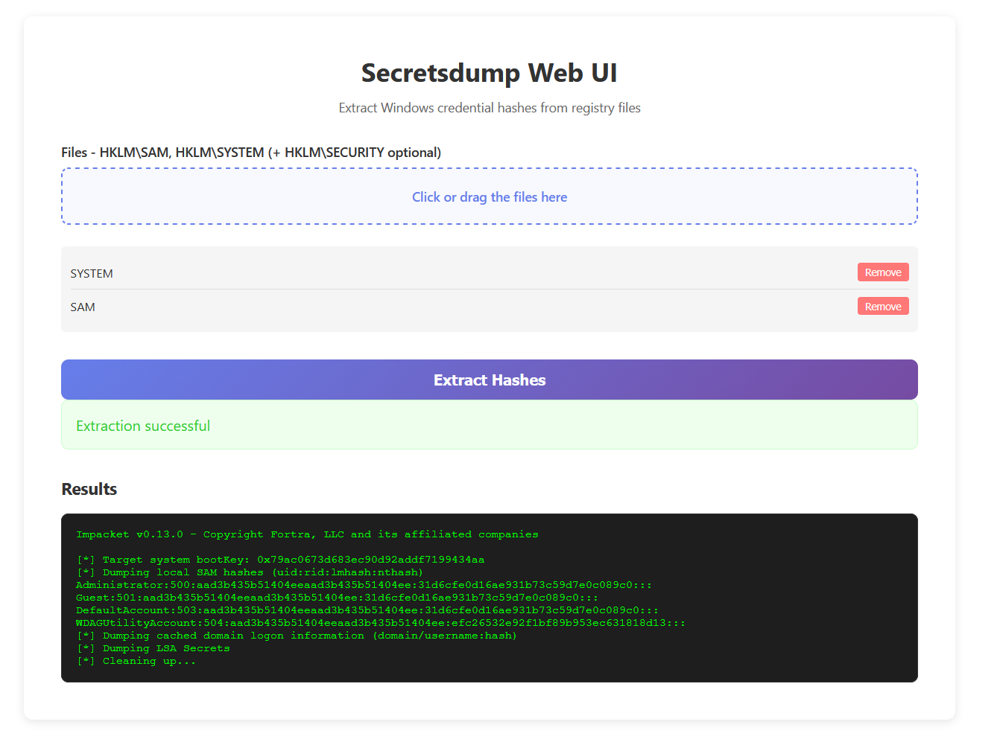

# samXporter

samXporter automates the extraction of Windows registry security hives (SAM, SYSTEM, and SECURITY) required for offline credential recovery. It handles the necessary privilege elevation and Windows API calls to backup them.

Available in two versions:
- **Python version**: Portable script using Python standard library
- **C version**: Standalone executable with no dependencies

## Requirements

### Python Version
- Windows operating system
- Python 3.6+
- Administrator privileges (required for hive extraction)

### C Version
- Windows operating system
- Administrator privileges (required for hive extraction)
- No runtime dependencies (compiled as standalone executable)

## Installation

### Python Version

1. Clone or download the script:
```bash
git clone https://github.com/CobblePot59/samXporter
cd samXporter
```

2. No additional dependencies required (uses only Python standard library)

### C Version

You can compile the C version using [dockompiler](https://github.com/CobblePot59/dockompiler/):

```bash
docker run --rm -v ${PWD}:/app cobblepot59/dockompiler compile-c samXporter.c samXporter.exe -ladvapi32 -luser32 -lshell32 -lshlwapi -municode -Wall
```

This will generate a standalone `samXporter.exe` that can be run directly on Windows without any dependencies.

## Usage

### Python Version

Run the script with administrator privileges:

```bash
python samXporter.py
```

### C Version

Run the compiled executable with administrator privileges:

```bash
samXporter.exe
```

### Output

```
Registry_Backup/
├── SAM
├── SYSTEM
└── SECURITY
```

## Extracting Credentials

Once you have the backed-up hives, you can extract credentials using one of the following methods:

### Method 1: Using impacket-secretsdump (CLI)

```bash
impacket-secretsdump -sam SAM -system SYSTEM -security SECURITY LOCAL
```

### Method 2: Using Docker Compose (Web Interface)

A web interface is available for drag-and-drop extraction of credentials.

```bash
cd secretsdump-dragdrop
docker-compose up -d
```

Then access the web interface at `http://localhost:5000` and upload your SAM, SYSTEM, and SECURITY files.



## Logging

The script uses Python's logging module with the following levels:

- **DEBUG** - Detailed operational information, errors, and API calls
- **INFO** - Successfully saved registry hives with file paths and sizes

Example output:
```
DEBUG: Registry Hives Backup Script started
DEBUG: Admin privileges detected
DEBUG: SeBackupPrivilege enabled successfully
INFO: Saved HKLM\SAM to C:\path\Registry_Backup\SAM (123456 bytes)
INFO: Saved HKLM\SYSTEM to C:\path\Registry_Backup\SYSTEM (654321 bytes)
INFO: Saved HKLM\SECURITY to C:\path\Registry_Backup\SECURITY (98765 bytes)
DEBUG: Backup completed successfully
```

## Disclaimer

This script interacts with sensitive system files. Use responsibly and only in environments where you have authorization. Unauthorized access to computer systems may be illegal.
